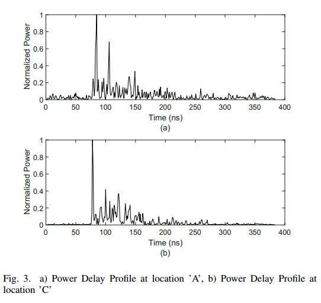
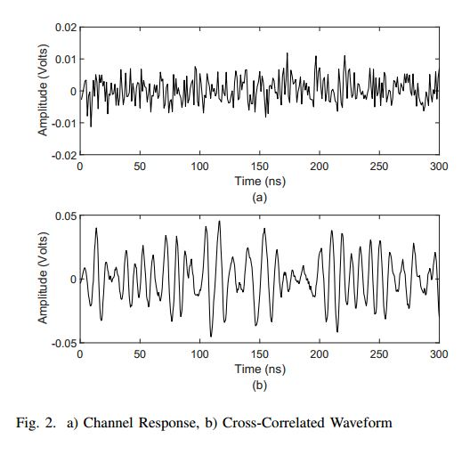
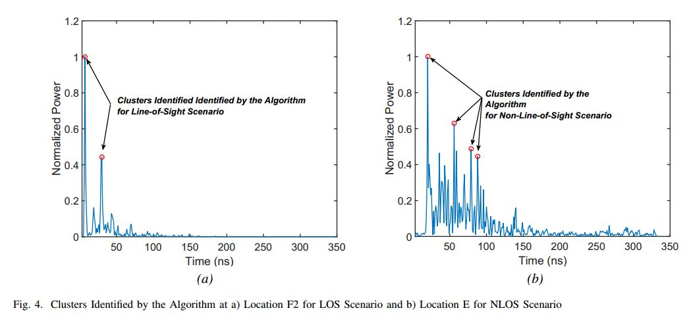

# New-Modeling-Methodology-for-Multipath-Parameter-Estimation
Multipath Profiles Extraction, Signal Parameter Estimation Strategies
The measurement datasets are actual radio measurements obtained from the University of Southern California's [Database](http://ultra.usc.edu/uwb_database/)
The results presented here showcase the code written for the elicitation of the proposed results.

## Multipath Profile Extraction:

 

## Cluster Identification Algorithm

